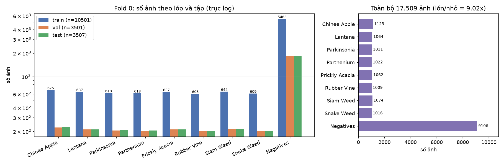
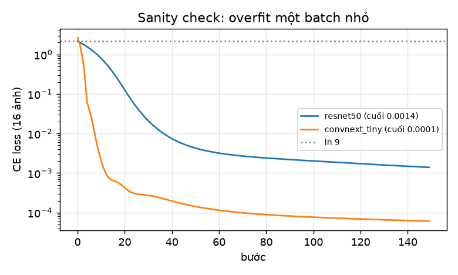
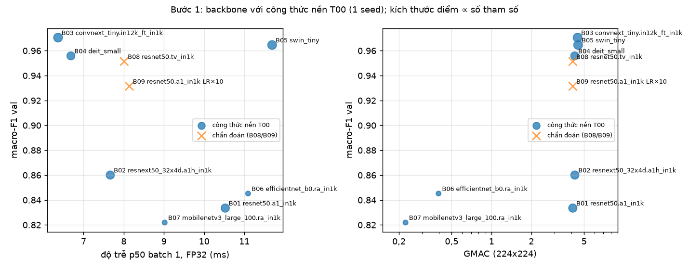
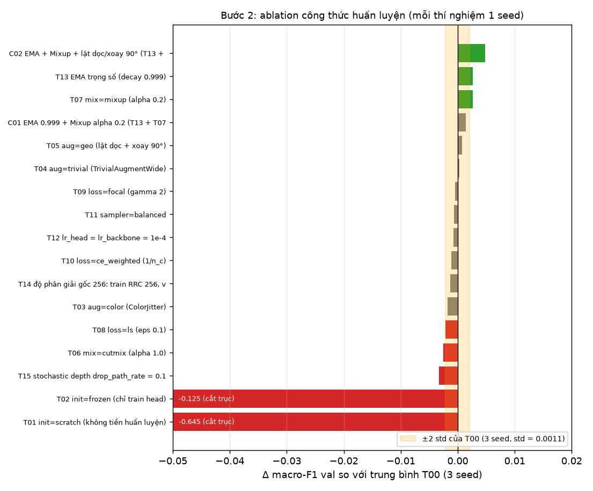
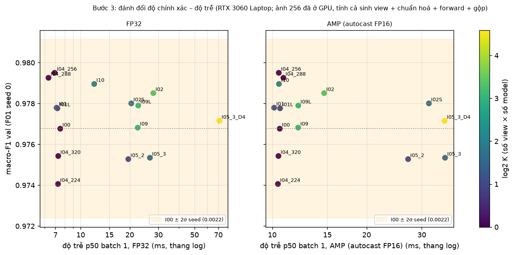
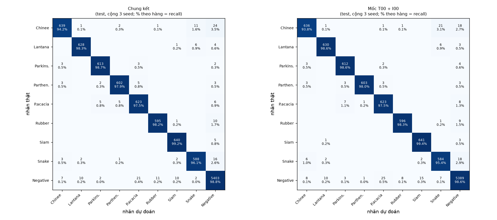
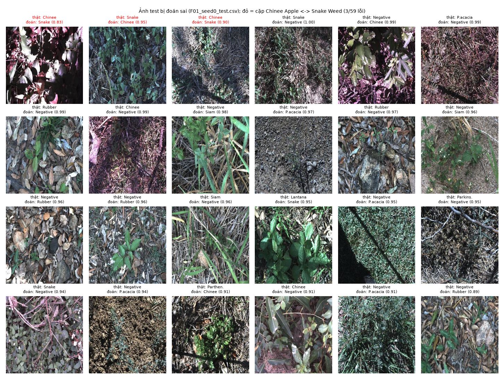
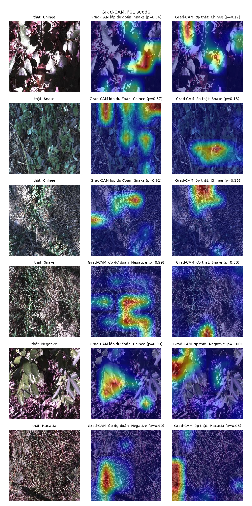

# Báo cáo Lab Day 2 — DeepWeeds: backbone, công thức huấn luyện, suy luận

*Phạm Quang Huy (MSSV: 2A202602900) · fold 0 · mọi số liệu truy ngược được tới `results.xlsx` → `exp_id` → `logs/<exp_id>/seed<k>/` (config, history theo epoch, summary) và `curves/<exp_id>_*.png`. Số test tính lại từ `predictions/` bằng `eval.py` gốc.*

## 1. Tóm tắt

* **Bài toán:** phân loại 9 lớp ảnh cỏ dại DeepWeeds, mất cân bằng (`Negatives` 52%). Dùng fold 0 chia sẵn, chỉ số chính là macro-F1.
* **Đã làm** (34 lần huấn luyện, ~5,5 giờ GPU trên RTX 3060 Laptop):
  * 7 backbone với cùng công thức nền, cộng 2 thí nghiệm chẩn đoán.
  * 15 ablation trên 7 trục công thức (khởi tạo, augmentation, loss, sampler, LR, chính quy hoá, độ phân giải), mỗi lần khác nền một yếu tố, cộng 2 kết hợp. Nhiễu được đo bằng 3 seed của nền.
  * Gần 20 biến thể suy luận (TTA lật/D4/multi-crop/đa tỉ lệ, gộp xác suất và logit, dò độ phân giải, ensemble, EMA, temperature scaling, FP16/AMP, gộp BN), có đo độ trễ p50/p95/p99.
  * Chung kết 3 seed, test chạy một lần mỗi seed.
* **Cấu hình tốt nhất (F01):** ConvNeXt-T `in12k_ft_in1k` + EMA + Mixup (α = 0,2) + lật dọc/xoay 90°, 12 epoch; suy luận 1 view ở ảnh đầy đủ 256 px, temperature scaling khớp trên val.
* **Kết quả test fold 0 (3 seed): macro-F1 0,9770 ± 0,0008; top-1 98,19 ± 0,12%;** recall Chinee Apple 94,2%, Snake Weed 96,1%; ECE 0,0041. Qua 3 fold (seed 0, thưởng): 0,9747 ± 0,0031.
  * Mốc T00 + I00 đạt 0,9749 ± 0,0010, nên Δ = +0,0021 ≈ 2 std: cải thiện nhỏ nhưng vượt nhiễu.
  * Độ trễ batch 1: p95 7,2 ms (FP32).
* **Kết luận chính:**
  1. **Backbone cùng trọng số tiền huấn luyện quyết định gần hết** (+0,137 macro-F1 val khi đổi ResNet-50 `a1` sang ConvNeXt-T). Riêng việc đổi *bộ trọng số* của cùng ResNet-50 (`a1` → `tv`) đã cho +0,118. Công thức huấn luyện và suy luận chỉ thêm vài phần nghìn, phần lớn sát ngưỡng nhiễu.
  2. Loss/sampler cho lớp hiếm chỉ dời lỗi giữa cỏ dại và `Negatives`, không tăng macro-F1.
  3. Trên robot nên dùng những thứ không tốn chi phí suy luận (EMA, độ phân giải đã dò, FP32 ở batch 1). TTA và ensemble không đáng giá.
  4. Chia ngẫu nhiên đặt 87% ảnh test cách một ảnh train ≤ 30 giây, nên **điểm test lạc quan** so với trang trại mới.

## 2. Dữ liệu và thiết lập

### 2.1 Dữ liệu, chia fold 0 và các kiểm tra bắt buộc

DeepWeeds: 17.509 ảnh RGB 256×256 (kiểm tra: 100% ảnh đúng 256×256, chế độ RGB), 9 lớp. `images.zip` tải từ Zenodo, MD5 `b7b30f96d466fba86016aa5a26606e0f` khớp; nhãn và fold lấy nguyên bản từ GitHub của tác giả. Dùng **fold 0** (`train/val/test_subset0.csv`), **không sửa, không lọc, không chia lại** (S1). Các kiểm tra (`code/dataset.py::check_split`) chạy ở đầu **mọi** lần train và được ghi vào `config.json` của từng lần chạy; tổng hợp ở `logs/eda.json`:

| Kiểm tra | Kết quả |
|---|---|
| Số ảnh train / val / test | **10.501 / 3.501 / 3.507** (59,97% / 20,00% / 20,03%; lệch < 0,05 điểm % so với 60/20/20) |
| Giao train∩val, train∩test, val∩test (theo tên file) | **0 / 0 / 0** |
| Hợp ba tập | **17.509** ảnh |
| File trong CSV không có trong thư mục ảnh | **0** |
| Tên file trùng trong cùng một tập | 0 |

Số ảnh theo lớp (đếm thật) so với Table 1 của bài báo:

| Lớp | Table 1 | train | val | test | tổng 3 tập |
|---|---:|---:|---:|---:|---:|
| Chinee Apple | 1.125 | 675 | 225 | 226 | 1.126 |
| Lantana | 1.064 | 637 | 213 | 213 | 1.063 |
| Parkinsonia | 1.031 | 618 | 206 | 207 | 1.031 |
| Parthenium | 1.022 | 613 | 204 | 205 | 1.022 |
| Prickly Acacia | 1.062 | 637 | 212 | 213 | 1.062 |
| Rubber Vine | 1.009 | 605 | 202 | 202 | 1.009 |
| Siam Weed | 1.074 | 644 | 215 | 215 | 1.074 |
| Snake Weed | 1.016 | 609 | 203 | 204 | 1.016 |
| **Negatives** | **9.106** | 5.463 | 1.821 | 1.822 | 9.106 |

`labels.csv` khớp Table 1 ở từng lớp. Tổng theo fold lệch **1 ảnh** ở hai lớp: `20170714-110407-3.jpg` mang nhãn *Chinee Apple* trong `train_subset0.csv` nhưng *Lantana* trong `labels.csv` (EDA tự phát hiện, `logs/eda.json`). Theo S1 tôi giữ nguyên file fold; ảnh này thuộc train nên không ảnh hưởng val/test.

**Nhận xét EDA.** Dữ liệu mất cân bằng mạnh: `Negatives` chiếm **52,0%**, tỉ lệ lớp lớn nhất / nhỏ nhất = 9.106 / 1.009 = **9,02×**; 8 loài cỏ thì gần cân bằng (1.009–1.125 ảnh). Một mô hình luôn đoán `Negatives` đạt top-1 ≈ 52% nhưng macro-F1 chỉ ≈ 0,076, nên **macro-F1 là chỉ số chính**. Ảnh mẫu (`figures/eda_samples.png`, 4 ảnh/lớp) cho thấy `Negatives` gồm đủ loại thực vật và nền đất ở cùng địa điểm, đa dạng hơn hẳn các lớp còn lại. Chinee Apple và Snake Weed đều là lá xanh nhỏ mọc thấp, chụp nhìn xuống, rất khó tách bằng mắt. Ánh sáng thay đổi mạnh (nắng gắt, bóng râm). Thống kê kênh trên 2.000 ảnh train: mean ≈ (0,378; 0,390; 0,381), std ≈ (0,236; 0,235; 0,232). Vì mọi backbone đều tiền huấn luyện, tôi chuẩn hoá theo **mean/std của bộ trọng số** (ImageNet cho mọi model trong bài), không dùng thống kê riêng của DeepWeeds.

### 2.2 Kiểm tra pipeline trước khi chạy thật (`code/sanity_checks.py`, `logs/sanity.json`)

| Kiểm tra | ResNet-50 (`a1_in1k`) | ConvNeXt-T (`in12k_ft_in1k`) |
|---|---|---|
| Loss CE ban đầu (head mới, 512 ảnh val), kỳ vọng ln 9 = 2,197 | 2,180 | 2,273 |
| Overfit 16 ảnh (2 ảnh/lớp), 150 bước | 2,186 → **0,0014**, acc 100% | 2,657 → **0,00006**, acc 100% |
| `eval()`: chênh lệch logit lớn nhất của ảnh 1 khi thay 7 ảnh còn lại trong batch | **0** | **0** |
| `train()`: như trên | 2,27 (BN dùng thống kê batch) | 0 (LayerNorm không phụ thuộc batch) |

Ảnh sau augmentation (đã giải chuẩn hoá, kèm nhãn) ở `figures/sanity_augmentations.png`; CutMix/Mixup kèm λ và hai nhãn ở `figures/sanity_mix.png`. Ảnh và nhãn khớp nhau. **Unit test tự viết** (`code/tests_code.py`, 20 test, đều qua): focal `γ=0` ≡ CE; label smoothing khớp `nn.CrossEntropyLoss(label_smoothing)`; λ của CutMix bằng 1 − diện tích hộp thực; Mixup trộn cả nhãn; weight decay = 0 cho norm/bias; đóng băng giữ BN ở eval và không cập nhật running stats; warmup + cosine giữ tỉ lệ LR head/backbone = 10; EMA; gộp BN khớp đầu ra; khớp nhiệt độ T tìm lại đúng T đã biết; đo độ trễ có synchronize. Hai test dùng dữ liệu thật: (a) ba đường suy luận (transform val lúc train, loader nạp sẵn, view I00 trên GPU) cho **cùng một tensor**; (b) TTA xếp K view vào một batch cho kết quả trùng K lượt forward riêng. Test của repo (`python -m unittest discover -s tests`, 38 test) cũng qua.

### 2.3 Chỉ số, phần cứng, quy tắc val/test

* Chỉ số theo README 2.2, tính bằng `eval.compute_metrics` (dùng ngay trong vòng train để chọn checkpoint): **macro-F1** (chính), top-1, balanced accuracy, P/R/F1 từng lớp, ECE 15 bin. mean ± std dùng `ddof=1`.
* Phần cứng: **RTX 3060 Laptop 6 GB**, Windows 11; torch 2.14.1+cu130, timm 1.0.30 (đủ phiên bản ở `README.md`). Batch 64 vừa VRAM cho mọi backbone (không cần tích luỹ gradient). `channels_last` làm backward chậm khoảng 8 lần trên máy này (đo bằng `probe_speed.py`), nên tôi tắt.
* **Val** dùng cho mọi lựa chọn: backbone, công thức, checkpoint (epoch có macro-F1 val cao nhất, hoà thì lấy epoch sớm hơn), phương pháp suy luận, nhiệt độ T. **Test** chỉ chạy ở Bước 4, **một lần cho mỗi seed**, bằng `code/final.py`. Script này từ chối ghi đè file test đã có và ghi nhật ký truy cập test vào `logs/final/test_access_log.csv`. Logit test **không** được tính trong lúc train (`save_test_predictions=False` cho mọi thí nghiệm B/T/C).
* Seed cố định `random`, `numpy`, `torch` và generator của DataLoader. `cudnn.benchmark=True` nên hai lần chạy cùng seed không trùng từng bit: B03 và T00 seed 0 có cùng cấu hình nhưng macro-F1 val là 0,9705 và 0,9714.
* Ngân sách tính toán (GUIDE mục 7): 12 epoch cho mọi lần chạy. Ablation chỉ trên 1 backbone (ConvNeXt-T) với 1 seed. 3 seed dành cho mốc T00 và chung kết F01. Tổng cộng 34 lần huấn luyện hoàn chỉnh (tổng thời gian chạy 5,5 giờ GPU, cộng khoảng 1 giờ cho suy luận, phân tích và đo độ trễ).

## 3. Bước 1 — So sánh backbone

Công thức nền T00 dùng chung cho mọi backbone (GUIDE 1.4):
* Khởi tạo ImageNet, thay head mới 9 lớp, tinh chỉnh toàn bộ.
* Train: `RandomResizedCrop(224)` + lật ngang. Val/test: ảnh 256 cắt giữa 224 (`crop_pct` 0,875, bicubic).
* AdamW; LR backbone 1e-4, head 1e-3; weight decay 0,05 (0 cho norm, bias, pos-embed); warmup 1 epoch rồi cosine về 0 **theo bước**.
* CE, batch 64, **12 epoch**, AMP FP16.
* Cùng seed 0, cùng split.

| exp_id | backbone (tag `timm`) | #params (M) | GMAC | macro-F1 val | top-1 val | F1 Chinee / Snake (val) | train/epoch (s) | p50 / p95 batch 1, FP32 (ms) |
|---|---|---:|---:|---:|---:|---|---:|---|
| B01 | `resnet50.a1_in1k` | 23,5 | 4,11 | 0,8335 | 0,8766 | 0,700 / 0,760 | 37,9 | 10,5 / 21,0 |
| B02 | `resnext50_32x4d.a1h_in1k` | 23,0 | 4,26 | 0,8601 | 0,8926 | 0,777 / 0,795 | 46,3 | 7,7 / 7,9 |
| **B03** | **`convnext_tiny.in12k_ft_in1k`** | 27,8 | 4,47 | **0,9705** | **0,9763** | **0,945 / 0,936** | 43,7 | **6,4** / 7,8 |
| B04 | `deit_small_patch16_224.fb_in1k` | 21,7 | 4,25 | 0,9558 | 0,9677 | 0,913 / 0,904 | 31,4 | 6,7 / 16,5 |
| B05 | `swin_tiny_patch4_window7_224.ms_in1k` | 27,5 | 4,51 | 0,9646 | 0,9737 | 0,926 / 0,921 | 53,8 | 11,7 / 13,5 |
| B06 | `efficientnet_b0.ra_in1k` | 4,0 | 0,40 | 0,8452 | 0,8857 | 0,717 / 0,767 | 24,2 | 11,1 / 11,5 |
| B07 | `mobilenetv3_large_100.ra_in1k` | 4,2 | 0,22 | 0,8219 | 0,8640 | 0,758 / 0,748 | 16,6 | 9,0 / 9,4 |
| B08 (chẩn đoán) | `resnet50.tv_in1k` | 23,5 | 4,11 | 0,9513 | 0,9637 | 0,898 / 0,903 | 35,6 | 8,0 / 9,3 |
| B09 (chẩn đoán, **khác nền**: LR ×10) | `resnet50.a1_in1k` | 23,5 | 4,11 | 0,9314 | 0,9480 | 0,863 / 0,882 | 35,6 | 8,1 / 10,7 |

Ghi chú về bảng:
* Mỗi backbone chạy 1 seed.
* #params đếm cả head 9 lớp; GMAC đếm bằng fvcore ở 224×224.
* Độ trễ sơ bộ: warmup 10 lần, đo 100 lần, có `cuda.synchronize`, chỉ tính forward. p95 dao động vì GPU laptop chạy WDDM và xung nhịp thay đổi; độ trễ được đo kỹ hơn ở Bước 3.
* Đường cong training của từng backbone: `curves/B0x_*.png`.

**Nhận xét.**
1. **Kết quả chia thành hai nhóm rõ rệt.** Ba backbone dùng LayerNorm (ConvNeXt-T, Swin-T, DeiT-S) đạt macro-F1 0,956–0,971. Bốn CNN dùng BatchNorm với trọng số `a1`/`ra` của timm chỉ đạt 0,82–0,86. Đường cong (`curves/B01_resnet50.png`, B02, B06, B07) cho thấy các CNN này **underfit**: train acc chỉ ~0,87–0,92 ở epoch 12 dù LR đã về 0, và train loss ≈ val loss. Đây không phải quá khớp. Val loss bám sát train loss, và test pipeline (mục 2.2) xác nhận các đường đánh giá trùng nhau, nên tôi loại trừ khả năng lỗi đánh giá. **Chẩn đoán (B08, B09; thêm sau khi thấy hiện tượng này):** cùng kiến trúc ResNet-50 nhưng dùng trọng số torchvision gốc `tv_in1k` (tiền huấn luyện CE + SGD cổ điển), với công thức nền, đạt **0,9513** (train acc 0,972 ở epoch 12, so với 0,873 của B01). Tức là **+0,118 chỉ nhờ đổi bộ trọng số**. Giữ bộ `a1_in1k` nhưng tăng LR 10 lần (B09: backbone 1e-3, head 1e-2) thì được 0,9314 (+0,098). Kết luận: các bộ trọng số `a1`/`ra` của timm (tiền huấn luyện bằng BCE/LAMB với LR cao và chính quy hoá mạnh) cần LR tinh chỉnh cao hơn hẳn mức 1e-4 của công thức nền. Ngay cả với LR phù hợp, bộ `a1` vẫn thua bộ `tv` cổ điển. Thứ hạng ở Bước 1 vì vậy phản ánh **cặp (kiến trúc, bộ trọng số) dưới một công thức tinh chỉnh cố định**, không phải kiến trúc thuần tuý. Ví dụ, ResNet-50 `tv` (0,951) gần bằng DeiT-S (0,956). B08/B09 chỉ dùng để chẩn đoán, không thay đổi lựa chọn backbone: ConvNeXt-T vẫn cao nhất.
2. **Thứ hạng khác ImageNet.** Theo các bài báo gốc (trích dẫn, không phải số của tôi), ResNet-50 A1 ("ResNet strikes back") đạt 80,4% top-1 ImageNet, cao hơn DeiT-S (79,8%). Trên DeepWeeds với cùng công thức tinh chỉnh, ResNet-50 lại thua DeiT-S 0,12 macro-F1. Trong nhóm LayerNorm thì thứ tự ConvNeXt-T > Swin-T > DeiT-S giữ nguyên như trên ImageNet. ConvNeXt-T dùng bộ `in12k_ft_in1k` (tiền huấn luyện trên ImageNet-12k rồi tinh chỉnh trên ImageNet-1k), nên một phần lợi thế của nó đến từ **dữ liệu và công thức tiền huấn luyện**, không chỉ từ kiến trúc (GUIDE §9.1).
3. **FLOPs không phải độ trễ.** EfficientNet-B0 chỉ 0,40 GMAC (ít hơn ConvNeXt-T 11 lần) nhưng p50 ở batch 1 là 11,1 ms, chậm hơn ConvNeXt-T (6,4 ms). Ở batch 1, GPU không bão hoà; thời gian bị chi phối bởi số kernel nhỏ (depthwise, SE) chứ không bởi số phép nhân-cộng. Thời gian *train* (batch 64, GPU bão hoà) thì tương quan với GMAC tốt hơn: MobileNetV3 16,6 s/epoch, EfficientNet 24,2 s, các mạng ~4 GMAC 31–54 s.
4. **Hội tụ.** ConvNeXt-T đạt 0,81 macro-F1 ngay sau epoch 1 (ResNet-50: 0,23). DeiT-S dao động mạnh ở epoch 2–4 (0,88 → 0,86 → 0,92), kiểu dao động thường gặp ở ViT khi tinh chỉnh với LR head lớn. Không backbone nào quá khớp rõ rệt trong 12 epoch: val loss của nhóm LayerNorm vẫn giảm hoặc đi ngang đến cuối.

**Chọn backbone cho Bước 2–4: ConvNeXt-T (B03).** Lý do:
* Macro-F1 val cao nhất (0,9705) và F1 tốt nhất ở cả hai lớp khó.
* p50 batch 1 thấp nhất trong 7 backbone (6,4 ms).
* Thời gian train trung bình (43,7 s/epoch).

Swin-T thấp hơn ConvNeXt-T 0,006 (so với B03) đến 0,008 (so với trung bình T00, cùng cấu hình với B03, 3 seed). Mức này lớn hơn nhiều so với nhiễu seed đo được của ConvNeXt (σ ≈ 0,001), dù Swin chỉ có 1 seed. Swin còn chậm hơn 23% khi train và 83% khi suy luận. Quy tắc chọn được viết ra trước khi có kết quả Swin: chỉ đổi sang Swin nếu Swin vượt > 0,005. Nếu cần mạng nhẹ hơn, DeiT-S train nhanh nhất trong nhóm tốt (31 s/epoch) nhưng kém 0,015.

## 4. Bước 2 — Công thức huấn luyện (ConvNeXt-T)

**Đo nhiễu trước:** T00 (= công thức nền) chạy 3 seed cho macro-F1 val **0,9714 / 0,9735 / 0,9724 → 0,9724 ± 0,0011**. Mỗi thí nghiệm sau chạy 1 seed (seed 0) và **chỉ khác T00 một yếu tố** (cột "khác T00" trong sheet `Training`). Δ được tính so với **trung bình** T00. Quy tắc kết luận: "tốt hơn/kém hơn" khi |Δ| > 2·std = 0,0021, ngược lại là "không phân biệt được".

Lưu ý thống kê:
* Std ước lượng từ chỉ 3 seed nên bản thân nó rất bất định.
* Hiệu giữa một lần chạy 1 seed và trung bình 3 seed có std ≈ √(1 + 1/3)·σ ≈ 1,15σ, nên ngưỡng chặt hơn là ≈ 2,3σ ≈ 0,0024.
* Vì vậy các kết luận có |Δ| quanh 0,002–0,003 chỉ là **gợi ý**.

| exp_id | trục | khác T00 ở điểm nào | macro-F1 val | Δ so với T00 | Δ/σ | bal. acc | recall Chinee / Snake / Negatives | ECE val | kết luận |
|---|---|---|---:|---:|---:|---:|---|---:|---|
| T00 | – | nền (3 seed) | 0,9724 ± 0,0011 | – | – | 0,973 | 0,920 / 0,951 / 0,986 (TB) | 0,0097 | – |
| T01 | A | khởi tạo ngẫu nhiên (từ đầu) | 0,3270 | −0,6454 | −609 | 0,320 | 0,209 / 0,128 / 0,894 | 0,0168 | kém hơn |
| T02 | A | đóng băng backbone, chỉ train head | 0,8479 | −0,1246 | −118 | 0,829 | 0,791 / 0,744 / 0,938 | 0,0337 | kém hơn |
| T03 | B | + ColorJitter(0,3; 0,3; 0,3; 0,05) | 0,9707 | −0,0018 | −1,7 | 0,968 | 0,911 / 0,946 / 0,988 | 0,0103 | không phân biệt được |
| T04 | B | + TrivialAugmentWide | 0,9727 | +0,0003 | +0,2 | 0,972 | 0,956 / 0,931 / 0,986 | 0,0099 | không phân biệt được |
| T05 | B | + lật dọc + xoay 90° (nhóm D4) | 0,9731 | +0,0007 | +0,7 | 0,970 | 0,924 / 0,961 / 0,990 | 0,0063 | không phân biệt được |
| T06 | B | CutMix (α = 1, mọi batch) | 0,9699 | −0,0026 | −2,4 | 0,974 | 0,924 / 0,956 / 0,979 | 0,0050 | kém hơn (sát ngưỡng) |
| T07 | B | Mixup (α = 0,2, mọi batch) | 0,9750 | +0,0026 | +2,4 | 0,970 | 0,938 / 0,936 / 0,992 | 0,0059 | tốt hơn (sát ngưỡng) |
| T08 | C | label smoothing ε = 0,1 | 0,9703 | −0,0021 | −2,0 | 0,968 | 0,911 / 0,936 / 0,987 | **0,0828** | kém hơn (đúng ngưỡng −2,0σ) |
| T09 | C | focal loss γ = 2 | 0,9720 | −0,0004 | −0,4 | 0,967 | 0,924 / 0,936 / 0,993 | 0,0281 | không phân biệt được |
| T10 | C | CE trọng số lớp ∝ 1/n_c | 0,9713 | −0,0011 | −1,1 | **0,977** | **0,960** / 0,926 / 0,980 | 0,0066 | không phân biệt được |
| T11 | D | sampler cân bằng lớp (có hoàn lại) | 0,9718 | −0,0006 | −0,6 | 0,975 | 0,938 / 0,941 / 0,982 | 0,0100 | không phân biệt được |
| T12 | E | cùng LR 1e-4 cho head và backbone | 0,9717 | −0,0007 | −0,7 | 0,971 | 0,938 / 0,941 / 0,986 | 0,0101 | không phân biệt được |
| T13 | F | EMA trọng số (decay 0,999) | 0,9751 | +0,0027 | +2,5 | 0,976 | 0,947 / 0,946 / 0,985 | 0,0084 | tốt hơn (sát ngưỡng) |
| T14 | G | độ phân giải 256 (train RRC 256, val ảnh đầy đủ 256) | 0,9711 | −0,0013 | −1,2 | 0,970 | 0,920 / 0,946 / 0,988 | 0,0099 | không phân biệt được |
| T15 | F | stochastic depth 0,1 | 0,9691 | −0,0033 | −3,1 | 0,968 | 0,902 / 0,941 / 0,986 | 0,0098 | kém hơn |
| C01 | B+F | EMA + Mixup (T13 + T07) | 0,9738 | +0,0014 | +1,3 | 0,971 | – | 0,0094 | không phân biệt được |
| **C02** | B+F | **EMA + Mixup + D4 (T13 + T07 + T05)** | **0,9772** | **+0,0048** | **+4,6** | **0,978** | – | 0,0074 | **tốt hơn** |

**Phân tích theo trục** (đường cong: `curves/T*.png`, `curves/C*.png`):

* **A. Khởi tạo — trục có tác dụng lớn nhất.**
  * Từ đầu (T01): sau 12 epoch chỉ đạt 0,327. Loss vẫn giảm đều (train 1,70 → 1,20, val 1,59 → 1,20), tức mạng còn xa mới hội tụ. Với ~10k ảnh và 12 epoch, ConvNeXt từ đầu không thể học kịp.
  * Đóng băng (T02): 0,848, train nhanh gấp ~3 lần (15,3 s/epoch). Đặc trưng ImageNet của ConvNeXt đã khá tốt nhưng không đủ: tinh chỉnh toàn bộ hơn 0,12 macro-F1.
  * Kết luận: trên dữ liệu khác miền ImageNet, **tiền huấn luyện + tinh chỉnh toàn bộ là bắt buộc**.
* **B. Augmentation.**
  * Mọi phép augmentation ảnh đơn (màu, TrivialAugment, D4) đều nằm trong nhiễu.
  * **Lật dọc/xoay 90° hợp lệ** với ảnh chụp nhìn xuống (không có "trên/dưới") và cho ECE thấp (0,0063). Một mình nó chưa vượt nhiễu, nhưng khi cộng vào C01 thì tạo khác biệt lớn nhất (C02).
  * **Mixup** (α = 0,2) giúp ở mức sát ngưỡng.
  * **CutMix** (α = 1) hơi kém. Giả thuyết (GUIDE §9.4): hộp cắt dán lớn (trung bình 50% diện tích) dễ cắt mất phần lá đặc trưng, vốn nhỏ, của loài cỏ, khiến nhãn trộn không còn khớp nội dung ảnh. Đường cong T06 cho thấy val loss vẫn đang giảm ở epoch 12, nên với 12 epoch CutMix chưa phát huy (CutMix thường cần công thức dài).
* **C. Loss.** Trên macro-F1, không loss nào vượt nhiễu. Khác biệt nằm ở **đánh đổi giữa các lớp** (GUIDE §9.3):
  * CE có trọng số (T10) và sampler cân bằng (T11) cho balanced accuracy cao nhất (0,977 và 0,975); recall Chinee của T10 lên tới 0,960. Cái giá là recall `Negatives` giảm (0,980 và 0,982 so với 0,986 của T00): mô hình đẩy biên về phía các lớp hiếm, nên nhiều ảnh `Negatives` bị đoán thành cỏ dại. Với robot phun thuốc, điều này nghĩa là phun nhầm nhiều hơn.
  * Label smoothing làm hiệu chuẩn tệ hẳn (ECE 0,083, gấp 8 lần). Nhãn mềm khiến mô hình **thiếu tự tin**: max-softmax trung bình trên val chỉ 0,895 (trung vị 0,915 ≈ mục tiêu 1 − ε + ε/9 = 0,911), trong khi accuracy là 0,977. T00 có max-softmax trung bình 0,987.
  * Focal loss cũng thiếu tự tin (max-softmax trung bình 0,951, ECE 0,028).
* **D. Sampler.** Sampler cân bằng (T11) có tác dụng gần giống CE có trọng số (cùng đánh đổi recall lớp hiếm với `Negatives`) và cũng không cải thiện macro-F1. Khác nhau ở cơ chế: sampler lặp lại ảnh lớp hiếm (mỗi epoch thấy ít ảnh `Negatives` khác nhau hơn), còn loss có trọng số giữ nguyên dữ liệu và chỉ đổi độ lớn gradient.
* **E. LR.** Cùng LR 1e-4 cho head (T12) không khác LR head gấp 10. Với ConvNeXt và 1 epoch warmup, head mới học đủ nhanh, nên trên backbone này kết quả không nhạy với tỉ lệ LR head/backbone.
* **F. Chính quy hoá.**
  * **EMA** vượt nhiễu (sát ngưỡng) mà gần như miễn phí: không tốn thêm chi phí suy luận, thời gian train/epoch không tăng (42,1 s so với 43,1–43,8 s của T00; chỉ thêm một lượt đánh giá val mỗi epoch để so với trọng số thường) (`curves/T13_ema.png`).
  * Theo epoch, EMA cao hơn trọng số thường rất nhiều ở đầu quá trình (epoch 1: 0,916 so với 0,822; epoch 3: 0,959 so với 0,918). Đến cuối, khi LR cosine về 0, hai bên hội tụ về nhau (epoch 12: 0,9723 so với 0,9723). Lợi ích của EMA vì vậy đến chủ yếu từ việc **làm trơn quỹ đạo**, giúp checkpoint tốt nhất (epoch 9) cao hơn.
  * Stochastic depth 0,1 (T15) kém hơn rõ (−3,1σ). Với 12 epoch, chính quy hoá thêm chỉ làm chậm hội tụ: ở epoch 12, train loss là 0,045 so với 0,034 của T00 và val loss 0,094 so với 0,092. Mô hình chưa quá khớp nên không cần thêm chính quy hoá.
* **G. Độ phân giải 256** (T14) không giúp mà train chậm thêm 22% (52,7 so với 43,1 s/epoch). Ảnh gốc chỉ 256×256, nên ở 224 mô hình đã nhìn được ~77% diện tích ảnh với đủ chi tiết.

**Kết hợp (greedy theo trục, chọn trên val).**
* Hai yếu tố vượt ngưỡng (EMA, Mixup) **không cộng dồn**: C01 = 0,9738, thấp hơn từng yếu tố riêng lẻ, dù chênh lệch vẫn trong ~1σ.
* Thêm D4 (C02) lại cho kết quả tốt nhất, 0,9772 (+4,6σ). Một giải thích hợp lý: Mixup + EMA làm chính quy hoá *theo nhãn*, còn D4 bổ sung **bất biến hình học đúng với miền dữ liệu**. Hai loại này bổ sung cho nhau, trong khi EMA và Mixup chồng lấn nhau (cả hai đều làm trơn).
* Thận trọng: C02 được chọn là giá trị lớn nhất trong 4 ứng viên 1 seed, nên số val của nó lạc quan (winner's curse). Vì vậy chung kết **huấn luyện lại 3 seed** (mục 6).
* Quy tắc chọn được viết sẵn trong `code/choose_final.py` (macro-F1 val cao nhất trong T13, T07, C01, C02); kết quả ghi ở `code/final_choice.json`.

## 5. Bước 3 — Phương pháp suy luận

**Thiết lập.**
* Model: F01 seed 0 (ConvNeXt-T, công thức C02, checkpoint EMA). Mọi số trong mục này đo trên **val**.
* Mỗi phương pháp sinh view trên GPU từ ảnh gốc 256. I00 trùng tiền xử lý lúc train (kiểm tra: argmax trùng 100% với logit lưu lúc train, chênh lệch logit ≤ 0,008 do AMP).
* Độ trễ được đo cho **cả phương pháp**: sinh view, chuẩn hoá, K view **xếp chung một batch** cho một lượt forward, rồi gộp. Ảnh đầu vào đã nằm trên GPU, nên không tính đọc/giải mã JPEG.
* Quy trình đo: warmup 10 lần, 200 lần đo, `torch.cuda.synchronize()` trước và sau mỗi lần; báo cáo p50/p95/p99 ở batch 1. Thông lượng đo ở batch 32.
* Phần cứng: RTX 3060 Laptop, torch 2.14.1 (`code/inference_exps.py`, `logs/inference/inference_val.csv`, `logs/inference/latency.csv`, sheet `Inference` và `Latency`).

| exp_id | phương pháp | K | macro-F1 val | top-1 val | ECE val | p50 / p95 / p99 FP32 (ms) | p50 / p95 / p99 AMP (ms) | ảnh/s (batch 32, AMP) | chi phí so với I00 (p50 FP32) |
|---|---|---:|---:|---:|---:|---|---|---:|---:|
| I00 | 1 view (ảnh 256 cắt giữa 224) — mốc | 1 | 0,9768 | 0,9826 | 0,0086 | 7,5 / 8,3 / 8,5 | 10,6 / 11,5 / 12,2 | 785 | 1,00× |
| I01 | TTA lật ngang, gộp xác suất | 2 | 0,9778 | 0,9834 | 0,0095 | 7,1 / 7,7 / 8,2 | 10,1 / 11,2 / 11,9 | 399 | 0,95× |
| I01L | TTA lật ngang, gộp **logit** (I03) | 2 | 0,9778 | 0,9834 | 0,0090 | 7,2 / 7,5 / 7,7 | 10,6 / 12,0 / 14,3 | 399 | 0,96× |
| I02 | TTA 5 crop 224 + lật | 10 | 0,9785 | 0,9843 | 0,0117 | 27,9 / 29,5 / 33,5 | 14,6 / 15,0 / 15,8 | 82 | 3,73× |
| I02S | TTA đa tỉ lệ ảnh đầy đủ {224, 256, 288} | 3 | 0,9780 | 0,9837 | 0,0197 | 20,4 / 23,3 / 24,6 | 31,6 / 34,4 / 36,1 | 196 | 2,73× |
| I04_224 | dò độ phân giải: ảnh đầy đủ ở 224 | 1 | 0,9741 | 0,9803 | 0,0141 | 7,3 / 8,0 / 8,5 | 10,4 / 14,9 / 15,5 | 757 | 0,97× |
| **I04_256** | **dò độ phân giải: ảnh đầy đủ ở 256** | 1 | **0,9795** | **0,9849** | 0,0124 | **6,9 / 7,2 / 7,6** | 10,5 / 11,2 / 12,4 | 601 | 0,92× |
| I04_288 | dò độ phân giải: ảnh đầy đủ ở 288 | 1 | 0,9793 | 0,9843 | 0,0239 | 6,3 / 9,1 / 9,6 | 10,9 / 11,8 / 14,5 | 471 | 0,85× |
| I04_320 | dò độ phân giải: ảnh đầy đủ ở 320 | 1 | 0,9754 | 0,9797 | 0,0303 | 7,3 / 8,7 / 9,1 | 10,5 / 13,2 / 16,0 | 385 | 0,97× |
| I09 | TTA D4 (4 góc xoay × lật), gộp xác suất | 8 | 0,9768 | 0,9829 | 0,0105 | 22,4 / 24,2 / 30,0 | 12,1 / 12,5 / 13,2 | 103 | 2,99× |
| I09L | TTA D4, gộp logit (I03) | 8 | 0,9779 | 0,9837 | 0,0091 | 22,6 / 22,9 / 23,4 | 12,1 / 12,2 / 12,3 | 103 | 3,01× |
| I10 | TTA 4 phép lật | 4 | 0,9790 | 0,9843 | 0,0112 | 12,1 / 13,1 / 16,0 | 10,5 / 12,7 / 16,0 | 205 | 1,62× |
| I05_2 | ensemble F01 + Swin-T (B05), TB xác suất | 2 | 0,9753 | 0,9823 | 0,0093 | 19,6 / 21,4 / 22,5 | 27,1 / 36,1 / 38,6 | 335 | 2,62× |
| I05_3 | ensemble F01 + Swin-T + DeiT-S (B04) | 3 | 0,9753 | 0,9817 | 0,0123 | 26,6 / 29,2 / 29,7 | 35,6 / 41,0 / 47,8 | 265 | 3,55× |
| I05_3_D4 | ensemble 3 model × TTA D4 | 24 | 0,9772 | 0,9834 | 0,0208 | 71,1 / 71,7 / 71,9 | 35,5 / 37,8 / 39,2 | 35 | 9,49× |
| I06 | trọng số EMA / trọng số thường (cùng epoch 9) | 1 | 0,9768 / 0,9753 | 0,9826 / 0,9806 | 0,0086 / 0,0055 | không tốn thêm | – | – | 1,00× |
| I07 | temperature scaling cho I00 (T = 0,899) | 1 | 0,9768 | 0,9826 | **0,0086 → 0,0051** | không tốn thêm | – | – | 1,00× |
| I07 | temperature scaling cho I10 (T = 0,857) | 4 | 0,9790 | 0,9843 | **0,0112 → 0,0033** | như I10 | – | – | 1,62× |

**I08 — FP16, AMP và gộp BatchNorm** (chỉ forward, đầu vào 224 đã ở GPU; sheet `Latency`):

| cấu hình | dtype | p50 / p95 / p99 batch 1 (ms) | ảnh/s batch 32 | ảnh hưởng độ chính xác (val) |
|---|---|---|---:|---|
| F01 seed 0 (ConvNeXt-T) | FP32 | 6,77 / 7,31 / 7,60 | 373 | mốc |
| F01 seed 0 | FP16 (`model.half()`) | 6,88 / 7,35 / 7,62 | **988** | argmax trùng FP32 100%, chênh lệch logit ≤ 0,029, macro-F1 không đổi |
| F01 seed 0 | AMP (autocast) | 9,87 / 10,87 / 11,87 | 784 | argmax trùng 100% |
| B01 ResNet-50 (có BN), chưa gộp BN | FP32 | 8,24 / 10,93 / 12,41 | 531 | macro-F1 0,8339 |
| B01, **gộp 53 cặp conv+BN** | FP32 | **6,05 / 8,51 / 9,29** | 529 | macro-F1 0,8346 (1 ảnh đổi nhãn do TF32); sai số logit 4,6e-6 khi tắt TF32 |
| B01, gộp BN | FP16 | 6,15 / 8,28 / 10,76 | 955 | – |

**Nhận xét.**
* **Mọi khác biệt nằm trong dải ±2σ nhiễu seed** (σ ≈ 0,0022 trên val của F01). So sánh giữa các phương pháp trên *cùng* một model là so sánh cặp nên ít nhiễu hơn so sánh giữa các seed, nhưng chênh lệch vẫn chỉ khoảng 10–30 ảnh trên 3.501. Các xếp hạng dưới đây vì vậy chỉ mang tính gợi ý.
* **Dò độ phân giải (FixRes) là thắng lợi "miễn phí".** Ảnh đầy đủ ở 256 (I04_256) tăng +0,0027 so với cắt giữa 224, còn độ trễ thì không đổi hoặc thấp hơn.
  * Khi train, `RandomResizedCrop` phóng to một vùng nhỏ lên 224, nên vật thể lúc train trông to hơn lúc test. Test ở độ phân giải cao hơn bù lại độ lệch này. Ảnh đầy đủ còn giữ lại 23% viền ảnh mà phép cắt giữa bỏ đi.
  * Cùng ảnh đầy đủ nhưng ép về 224 (I04_224) thì kém hơn (0,9741): mô hình mất chi tiết. Phóng lên 320 (I04_320) cũng kém, vì ảnh gốc chỉ 256 nên phóng to chỉ thêm điểm ảnh nội suy và lệch thống kê so với lúc train.
* **TTA:**
  * Lật ngang (K = 2) +0,0010; 4 phép lật (K = 4) +0,0022; 5 crop + lật (K = 10) +0,0017; D4 (K = 8) +0,0000 khi gộp xác suất và +0,0011 khi gộp logit.
  * Ở FP32, chi phí gần tuyến tính theo K khi K ≥ 4: K = 8 tốn 3,0×, K = 10 tốn 3,7×.
  * Ở batch 1, xếp 2 view vào một batch gần như không tốn thêm (0,95×), vì GPU chưa bão hoà.
  * TTA không phải "độ chính xác miễn phí" (GUIDE §8). Lật ngang đổi 13 dự đoán: 8 từ sai thành đúng, nhưng **5 từ đúng thành sai**. Với D4, 11 ca sai thành đúng và 10 ca đúng thành sai. Ảnh nhìn từ trên xuống nên xoay 90° là phép bất biến hợp lệ, và mô hình đã được train với D4. Vì vậy TTA D4 hầu như không thêm thông tin mới.
* **I03 — gộp xác suất hay logit:** với K = 2 hai cách cho kết quả như nhau. Với D4 (K = 8), gộp logit tốt hơn (+0,0011) và có ECE thấp hơn. Bằng chứng chưa đủ mạnh để khẳng định cách nào luôn tốt hơn.
* **Ensemble khác kiến trúc (I05) kém hơn model đơn.** Swin-T và DeiT-S được train bằng công thức nền và yếu hơn F01 (0,965 và 0,956 so với 0,977), nên trung bình xác suất bị kéo xuống. Ensemble chỉ có lợi khi các thành viên **mạnh ngang nhau** và sai khác nhau, đúng như slide nói về chi phí = số model. Ensemble 3 model × D4 (K = 24) tốn 9,5× mà vẫn không vượt I04_256.
* **EMA (I06):** cùng epoch 9, trọng số EMA cho 0,9768 so với 0,9753 của trọng số thường, mà không tốn thêm gì lúc suy luận.
* **Hiệu chuẩn (I07).** T khớp trên val nhỏ hơn 1 (0,90 với I00, 0,86 với I10), tức F01 **thiếu tự tin**. Điều này phù hợp với tác dụng của Mixup (nhãn mềm): max-softmax trung bình trên val của T07 là 0,981, so với 0,987 của T00. TS làm sắc phân phối: ECE val giảm 0,0086 → 0,0051 (I00) và 0,0112 → 0,0033 (I10); argmax không đổi nên accuracy giữ nguyên.
  * ECE đo trên chính tập dùng để khớp T thì lạc quan. Kiểm tra chéo (khớp T trên nửa val, đo ECE trên nửa còn lại) cho 0,0073 ở cả hai, vẫn tốt hơn trước TS.
  * Reliability diagram: `figures/reliability_val.png`.
* **FP16, AMP và độ trễ (I08).** Ở **batch 1**, FP16 không nhanh hơn FP32 (6,9 so với 6,8 ms), còn AMP **chậm hơn** (9,9 ms) vì chi phí ép kiểu từng lớp lớn hơn thời gian tính khi GPU chưa bão hoà, đúng như slide trang 73 cảnh báo. Ở **batch 32**, FP16 cho thông lượng gấp 2,6 lần FP32 (988 so với 373 ảnh/s). Như vậy FP16 hợp cho xử lý ngoại tuyến hàng loạt, còn ở batch 1 thì FP32 là đủ.
* **Gộp BN (I08)** chỉ áp dụng được cho CNN có BatchNorm; ConvNeXt dùng LayerNorm nên có 0 cặp. Trên ResNet-50, gộp BN giảm p50 batch 1 từ 8,2 xuống 6,1 ms (−27%) mà không đổi kết quả. Phép gộp chính xác: sai số logit 4,6e-6 khi tắt TF32. Ở batch 32 thông lượng không đổi, vì lúc đó BN chỉ là phần nhỏ của chi phí.

**Ngoại tuyến hay thời gian thực?** Dữ liệu của tôi ủng hộ kết luận của slide:
* Trên robot, nên dùng những thứ **không tốn thêm** chi phí suy luận: EMA, độ phân giải đã dò (I04_256), FP32/FP16, gộp BN nếu là CNN. I04_256 có p95 = 7,2 ms ở batch 1, chỉ chiếm 7% ngân sách 100 ms.
* TTA K ≥ 4 và ensemble chỉ đáng dùng ngoại tuyến, và ngay cả khi đó lợi ích ở đây vẫn nằm trong nhiễu.

**Chọn phương pháp cho chung kết** (`code/choose_method.py`, quy tắc viết trước khi chạy Bước 3 đầy đủ): chọn phương pháp một model có macro-F1 val cao nhất với p95 batch 1 ≤ 50 ms, hoà thì chọn p50 nhỏ hơn, cộng thêm temperature scaling. Kết quả là **I04_256 + TS** (`code/final_method.json`). Cần thận trọng: đây là giá trị lớn nhất trong khoảng 12 phương pháp trên một model và một tập val, nên mức +0,0027 trên val có thể lạc quan (winner's curse). Test ở mục 6 kiểm chứng điều này.

## 6. Bước 4 — Cấu hình tốt nhất và kết quả test

### 6.1 Cấu hình chung kết F01 (đủ để tái lập)

| Thành phần | Giá trị |
|---|---|
| Backbone | `convnext_tiny.in12k_ft_in1k` (timm 1.0.30), head mới `Linear(768, 9)`, tinh chỉnh toàn bộ |
| Augmentation train | `RandomResizedCrop(224, scale=(0,08; 1), bicubic)` + lật ngang + **lật dọc + xoay ngẫu nhiên bội số 90°** (nhóm D4) + **Mixup α = 0,2** ở mọi batch (loss = λ·CE(y_a) + (1 − λ)·CE(y_b)) |
| Chuẩn hoá | mean/std ImageNet (0,485; 0,456; 0,406) / (0,229; 0,224; 0,225) |
| Tối ưu | AdamW (β = 0,9 / 0,999); LR backbone 1e-4, head 1e-3; weight decay 0,05 (0 cho norm/bias); warmup tuyến tính 1 epoch rồi cosine về 0 theo bước; batch 64; **12 epoch**; AMP FP16 |
| EMA | decay 0,999, có khởi động d_t = min(0,999; (1 + t)/(10 + t)); đánh giá và lưu checkpoint bằng trọng số EMA |
| Checkpoint | epoch có macro-F1 val cao nhất (seed 0: epoch 9; seed 1: 12; seed 2: 9) |
| Suy luận | **1 view, ảnh đầy đủ 256×256 (không cắt), I04_256** |
| Hiệu chuẩn | temperature scaling, T khớp trên val của từng seed: 0,838 / 0,926 / 0,845 |
| Seed | 0, 1, 2 |
| Lệnh | `experiments.py --ids F01 --seeds 0 1 2` rồi `final.py --exp F01 --seeds 0 1 2 --method I04_256 --ts` |

### 6.2 Kết quả test (chạy đúng một lần mỗi seed; `logs/final/test_access_log.csv`)

Số được tính lại bằng `python eval.py score` từ `predictions/` (`logs/eval/score_*.txt`) và trùng sheet `Final` của `results.xlsx`.

| exp_id | seed | macro-F1 val | macro-F1 **test** | top-1 test | balanced acc test | ECE test (sau TS) | ECE test (chưa TS) | recall Chinee / Snake (test) |
|---|---|---:|---:|---:|---:|---:|---:|---|
| F01 | 0 | 0,9795 | 0,9780 | 0,9832 | 0,9794 | 0,0029 | 0,0107 | 0,947 / 0,971 |
| F01 | 1 | 0,9747 | 0,9764 | 0,9818 | 0,9777 | 0,0057 | 0,0088 | 0,942 / 0,966 |
| F01 | 2 | 0,9766 | 0,9767 | 0,9809 | 0,9728 | 0,0038 | 0,0117 | 0,938 / 0,946 |
| **F01** | **TB ± std (3 seed)** | **0,9769 ± 0,0024** | **0,9770 ± 0,0008** | **0,9819 ± 0,0012** | 0,9766 ± 0,0034 | **0,0041 ± 0,0014** | 0,0104 ± 0,0015 | **0,942 ± 0,004 / 0,961 ± 0,013** |
| T00 + I00 (mốc) | 0 / 1 / 2 | 0,9714 / 0,9735 / 0,9724 | 0,9741 / 0,9760 / 0,9745 | 0,9789 / 0,9818 / 0,9803 | 0,9738 / 0,9781 / 0,9755 | 0,0105 / 0,0084 / 0,0072 (không TS) | – | 0,934 / 0,941; 0,942 / 0,966; 0,938 / 0,956 |
| **T00 + I00** | **TB ± std (3 seed)** | 0,9724 ± 0,0011 | **0,9749 ± 0,0010** | **0,9803 ± 0,0014** | 0,9758 ± 0,0022 | 0,0087 ± 0,0017 | – | 0,938 ± 0,004 / 0,954 ± 0,012 |

**So với mốc.**
* Macro-F1 test tăng **Δ = +0,0021**. Std lớn hơn trong hai nhóm là s = 0,0010, nên Δ ≈ 2,1·s. Kiểm định t Welch trên 3 + 3 seed cho t = 2,88 (p ≈ 0,047, df ≈ 3,9). Đây là cải thiện **nhỏ nhưng vượt nhiễu seed**: cả 3 seed của F01 (0,9764–0,9780) đều cao hơn cả 3 seed của mốc (0,9741–0,9760).
* Top-1 tăng +0,16 điểm % (98,03 → 98,19%), ngang cỡ std, nên **không phân biệt được** trên top-1.
* Mức cải thiện tập trung ở lớp khó: F1 Snake Weed tăng 0,949 → 0,965 (precision 0,944 → 0,969), F1 Chinee Apple 0,954 → 0,959.
* Hiệu chuẩn tốt hơn rõ: ECE 0,0087 → 0,0041, NLL 0,069 → 0,060.

**Val và test nhất quán.** Macro-F1 val của F01 (0,9769, đo bằng chính phương pháp I04_256 + TS) gần như trùng test (0,9770, chênh 0,0001). Mốc thì test cao hơn val (0,9749 so với 0,9724), tức test fold 0 hơi "dễ" hơn val ở mức ~0,0025. Mức cải thiện trên val (+0,0045) lớn hơn trên test (+0,0021). Điều này đúng như đã cảnh báo: chọn cấu hình bằng giá trị lớn nhất trên val thì val lạc quan, còn test là con số không thiên lệch.

**Đóng góp của từng phần** (đo trên **val** để không phải chạy test thêm lần nào):

| Bước | thay đổi | macro-F1 val | Δ |
|---|---|---:|---:|
| backbone | ResNet-50 `a1` (B01) → ConvNeXt-T `in12k` (B03), cùng công thức nền | 0,8335 → 0,9705 | **+0,137** |
| công thức huấn luyện | T00 (TB 3 seed) → F01 với I00 (TB 3 seed) | 0,9724 → 0,9756 | +0,0032 |
| suy luận | F01 I00 → F01 I04_256 + TS (TB 3 seed) | 0,9756 → 0,9769 | +0,0013 |

Backbone (gồm cả bộ trọng số tiền huấn luyện) đóng góp gấp khoảng 30 lần hai bước còn lại cộng lại (0,137 so với 0,0045). Trên một backbone tốt, công thức và suy luận chỉ thêm vài phần nghìn, và phần lớn trong số đó nằm sát ngưỡng nhiễu.

**Theo lớp (test, TB 3 seed, sheet `PerClass`):**

| Lớp | số ảnh | Precision | Recall | F1 | F1 mốc T00 |
|---|---:|---|---|---|---|
| Chinee Apple | 226 | 0,976 ± 0,002 | **0,942 ± 0,004** | 0,959 ± 0,001 | 0,954 ± 0,001 |
| Lantana | 213 | 0,980 ± 0,014 | 0,983 ± 0,010 | 0,981 ± 0,002 | 0,982 ± 0,005 |
| Parkinsonia | 207 | 0,986 ± 0,008 | 0,987 ± 0,007 | 0,986 ± 0,003 | 0,982 ± 0,005 |
| Parthenium | 205 | 0,987 ± 0,006 | 0,979 ± 0,003 | 0,983 ± 0,002 | 0,989 ± 0,004 |
| Prickly Acacia | 213 | 0,956 ± 0,009 | 0,975 ± 0,007 | 0,965 ± 0,005 | 0,964 ± 0,004 |
| Rubber Vine | 202 | 0,980 ± 0,005 | 0,982 ± 0,006 | 0,981 ± 0,001 | 0,984 ± 0,001 |
| Siam Weed | 215 | 0,979 ± 0,011 | 0,992 ± 0,003 | 0,985 ± 0,006 | 0,984 ± 0,007 |
| Snake Weed | 204 | 0,969 ± 0,012 | **0,961 ± 0,013** | 0,965 ± 0,009 | 0,949 ± 0,004 |
| Negatives | 1.822 | 0,987 ± 0,005 | 0,988 ± 0,002 | 0,988 ± 0,002 | 0,987 ± 0,002 |

**So với bài báo gốc** (số trích dẫn, README 2.3):
* Top-1 test 98,19% của tôi cao hơn ResNet-50 (95,7%) và Inception-v3 (95,1%). Recall Chinee Apple 94,2% và Snake Weed 96,1% cao hơn mốc bài báo (88,5% và 88,8%).
* So sánh này **chỉ mang tính tham khảo**: (1) backbone và tiền huấn luyện khác (ConvNeXt-T ImageNet-12k so với ResNet-50 ImageNet-1k năm 2019); (2) tôi chỉ đo trên một fold, bài báo lấy trung bình 5 fold với "weighted average accuracy"; (3) tôi train 12 epoch, bài báo khoảng 100 epoch.
* Chính Bước 1 cho thấy kết quả phụ thuộc mạnh vào bộ trọng số. Với công thức 12 epoch của tôi, ResNet-50 `a1_in1k` chỉ đạt 87,7% top-1 val, thấp hơn bài báo, còn ResNet-50 `tv_in1k` đạt 96,4% top-1 val (1 seed, chỉ fold 0).

**Tự chấm phần I** (`python eval.py grade`, `logs/eval/grade.txt`):

| Mã | Kết quả | Điểm đề xuất |
|---|---|---|
| I1 | top-1 test 98,19% (≥ 95,7%) | 7/7 |
| I2 | Δ macro-F1 = +0,0021 > s = 0,0010 nhưng < 0,01 | 4/5 |
| I3 | recall Chinee 94,2%, Snake 96,1% (cả hai ≥ mốc bài báo) | 4/4 |
| I4 | (a) ECE test 0,0104 → 0,0041 sau TS; (b) chênh macro-F1 val/test 0,0001 | 2/2 |
| I5 | F01 (I04_256): p95 batch 1 = 7,2 ms FP32 trên RTX 3060 Laptop, đo đúng cách | 2/2 |

### 6.3 Phân tích lỗi (sau khi đã chốt test; không ảnh hưởng lựa chọn nào)

Ma trận nhầm lẫn trên test, cộng 3 seed (`code/error_analysis.py`, `logs/eval/F01_confusion_sum.csv`):

| Nhầm lẫn (thật → đoán), cộng 3 seed | F01 | Mốc T00 + I00 | Bài báo (ResNet-50, trích dẫn) |
|---|---:|---:|---:|
| Chinee Apple → Snake Weed | 11 (1,6%) | 21 (3,1%) | 3,4% |
| Snake Weed → Chinee Apple | 3 (0,5%) | 6 (1,0%) | 4,1% |
| Chinee Apple → Negatives | **24 (3,5%)** | 18 (2,7%) | – |
| Snake Weed → Negatives | **16 (2,6%)** | 18 (2,9%) | – |
| Negatives → Prickly Acacia | 21 (0,4%) | 25 (0,5%) | – |
| Parkinsonia → Prickly Acacia | 3 (0,5%) | 2 (0,3%) | 1,3% |

**Lỗi thay đổi thế nào so với mốc.**
* Cặp khó kinh điển Chinee ↔ Snake giảm một nửa so với mốc: 27 → 14 ca. Đây là nguồn chính của mức tăng F1 Snake Weed.
* Lỗi chủ yếu còn lại là **cỏ dại bị đoán thành `Negatives`** (Chinee → Neg 3,5%, Snake → Neg 2,6%) và ngược lại (Neg → Prickly Acacia, Rubber Vine, Siam Weed, Lantana: 10–21 ca mỗi loại).
* Tức mô hình phân biệt các loài với nhau khá tốt; cái khó là quyết định *ảnh có chứa loài mục tiêu hay không*.

**Xem ảnh đoán sai** (seed 0: 59/3.507 ảnh sai, trong đó 3 ca thuộc cặp Chinee ↔ Snake), giả thuyết:
1. **Cây mục tiêu chỉ chiếm phần nhỏ của ảnh hoặc bị che lẫn trong thảm lá khô, cỏ khô.** Ví dụ Rubber Vine, Chinee, Snake bị đoán Negative với độ tin cậy 0,94–1,00. Grad-CAM (`figures/gradcam_misclassified.png`) cho thấy ở các ca Snake → Negative, mô hình nhìn vào kết cấu cỏ khô trên diện rộng; bản đồ cho lớp thật chỉ sáng ở một mảng nhỏ. Nhãn DeepWeeds là nhãn cả ảnh, không có hộp bao, nên ảnh "có một chút Snake Weed" vẫn mang nhãn Snake Weed. Mô hình học theo phần nền đa số.
2. **Ca Chinee ↔ Snake:** lá xanh nhỏ, mọc thấp, ánh sáng gắt, bóng đổ mạnh. Grad-CAM của lớp dự đoán và lớp thật rơi vào *các cụm lá khác nhau trong cùng ảnh*, nên rất có thể ảnh chứa cây giống cả hai loài.
3. **Có thể có nhiễu nhãn ở `Negatives`.** Vài ảnh Negative bị đoán Chinee/Siam với độ tin cậy 0,98–0,99 có lá trông rất giống loài mục tiêu (`Negatives` gồm cả "thực vật không phải loài mục tiêu" mọc cùng chỗ). Chưa kiểm chứng được nếu không có chuyên gia.
4. **Ánh sáng — kiểm chứng định lượng** (`code/photometric_errors.py`, `logs/analysis/photometric_errors.json`, 3 seed):
   * 10% ảnh test **tối nhất** có tỉ lệ lỗi **3,2%**, gấp đôi 90% còn lại (1,65%), nhất quán ở cả 3 seed.
   * 10% ảnh tương phản cao nhất (nắng gắt, bóng đổ): 2,6% so với 1,7%.
   * Giả thuyết ban đầu khi nhìn lưới ảnh là "ảnh ám màu hồng tím bị đoán sai nhiều" thì **bị bác bỏ**: 10% ảnh ám tím nhất có tỉ lệ lỗi chỉ 0,95% so với 1,9%.
   * Kết quả về ảnh tối khớp với thí nghiệm làm tối ảnh val ở mục 9.3.

## 7. Kết luận và khuyến nghị

1. **Cấu hình tốt nhất** là F01: ConvNeXt-T `in12k_ft_in1k`, EMA + Mixup + D4, 12 epoch, suy luận 1 view ở ảnh đầy đủ 256, temperature scaling.
   * Test fold 0 (3 seed): **macro-F1 0,9770 ± 0,0008, top-1 98,19 ± 0,12%**; recall Chinee/Snake 94,2% / 96,1%; ECE 0,0041.
   * So với mốc T00 + I00 (0,9749 ± 0,0010), mức tăng là +0,0021 ≈ 2,1 lần std (t Welch = 2,9 với 3 + 3 seed). Đây là **cải thiện nhỏ nhưng vượt nhiễu**. Top-1 thì không phân biệt được.
2. **Yếu tố đóng góp nhiều nhất là backbone cùng bộ trọng số tiền huấn luyện.**
   * Đổi ResNet-50 `a1` sang ConvNeXt-T `in12k` với cùng công thức: +0,137 macro-F1 val.
   * Công thức huấn luyện: +0,003. Suy luận: +0,001.
   * Trong công thức huấn luyện, khởi tạo là trục quyết định: bỏ tiền huấn luyện mất 0,65, đóng băng backbone mất 0,12. Các trục còn lại (augmentation, loss, sampler, LR, chính quy hoá, độ phân giải) chỉ tạo khác biệt cỡ nhiễu khi đứng riêng lẻ.
   * Kết hợp đúng ba yếu tố (EMA, Mixup, D4) cho +0,005 trên val và +0,002 trên test. Các yếu tố không cộng dồn tuyến tính: EMA + Mixup đi cùng nhau còn kém hơn từng yếu tố riêng.
3. **Loss và sampler cho lớp hiếm** (CE có trọng số, sampler cân bằng) không cải thiện macro-F1. Chúng chỉ *dời* lỗi: recall lớp cỏ dại tăng, recall `Negatives` giảm. Việc chọn cách nào là quyết định nghiệp vụ, tức phun nhầm hay bỏ sót thì tốn kém hơn, chứ không phải câu hỏi về độ chính xác.
4. **Triển khai trên robot (ngân sách 30–100 ms/khung).** Chọn F01 với I04_256, chạy **FP32 ở batch 1** (hoặc FP16, độ trễ như nhau): p50 6,9 ms, p95 7,2 ms, p99 7,6 ms trên RTX 3060 Laptop, tính cả tạo view và chuẩn hoá. Macro-F1 test 0,9770, ECE 0,0041.
   * Không dùng AMP ở batch 1 (chậm hơn 40%) và không dùng TTA hay ensemble: các phương pháp này tốn 1,6–9,5× mà lợi ích nằm trong nhiễu.
   * Trên phần cứng nhúng (Jetson; bài báo đo ResNet-50 53–180 ms), cần đo lại. ConvNeXt-T có ~4,5 GMAC, ngang ResNet-50, nên thời gian sẽ cùng cỡ với số của bài báo. Nếu phần cứng yếu hơn nữa, MobileNetV3 (9 ms trên GPU này, 0,22 GMAC) cần một công thức khác (LR cao hơn, train lâu hơn, chưng cất từ F01), vì với công thức 12 epoch hiện tại nó chỉ đạt 0,82.
   * Xử lý **ngoại tuyến** (lập bản đồ cỏ từ ảnh đã chụp): FP16 ở batch 32 cho ~990 ảnh/s. Có thể thêm TTA 4 phép lật (I10) nếu chấp nhận lợi ích chưa chắc chắn.
5. **Hiệu chuẩn.** Mô hình chung kết hơi thiếu tự tin (T khớp trên val < 1), phù hợp với tác dụng của Mixup. Temperature scaling khớp trên val giảm ECE test từ 0,0104 xuống 0,0041 và giảm NLL. Nếu dùng xác suất để đặt ngưỡng phun, nên áp dụng TS. Với dữ liệu khác miền, cần khớp lại T (xem mục 9.3: dưới lệch phân phối, T khớp trên val sạch không giữ được hiệu chuẩn).

## 8. Hạn chế và việc tiếp theo

* **Một fold, chia ngẫu nhiên không theo địa điểm.** Tên file DeepWeeds là thời điểm chụp. Đo trên fold 0 (`code/temporal_overlap.py`, `logs/analysis/temporal_overlap.json`), **87% ảnh test có một ảnh train chụp cách không quá 30 giây** (51% trong vòng 10 giây; trung vị 10 giây), tức cùng một lượt chụp liên tiếp của cùng cảnh. Vì vậy điểm test 98,2% đo khả năng nhận lại cảnh *đã thấy*, và **chắc chắn lạc quan** so với khi robot gặp một trang trại hoặc một buổi chụp mới. Kết quả trên fold 1, 2 (mục 9.1) chỉ xác nhận độ ổn định qua các cách chia *ngẫu nhiên*, không thay được đánh giá theo địa điểm.
* **Số seed ít.** Ablation 1 seed, chung kết và mốc 3 seed. Std ước lượng từ 3 seed rất bất định. Nhiều kết luận ở Bước 2–3 (EMA, Mixup, CutMix, TTA) chỉ sát ngưỡng 2σ, nên tôi đã ghi là "gợi ý".
* **Thiên lệch do chọn trên val.** Công thức (max của 4 ứng viên) và phương pháp suy luận (max của ~12) đều chọn bằng giá trị lớn nhất trên val. Mức cải thiện trên val (+0,0045) gấp đôi trên test (+0,0021). Con số test (chạy một lần) mới là ước lượng đúng.
* **Ngân sách GPU:**
  * 12 epoch cho mọi lần chạy. CutMix và train từ đầu chắc chắn cần lâu hơn, nên kết luận "CutMix không giúp" chỉ đúng cho công thức ngắn.
  * Ablation chỉ trên ConvNeXt-T. Các CNN dùng trọng số `a1`/`ra` của timm underfit với công thức nền. B08/B09 cho thấy nguyên nhân là bộ trọng số kết hợp với LR thấp, nhưng tôi không tối ưu riêng công thức cho từng backbone (GUIDE yêu cầu cùng một công thức cho mọi backbone).
  * Không thử SGD, LR theo tầng, hay 20 epoch.
* **Thí nghiệm thất bại hoặc phải chạy lại:**
  * Lần chạy B03 đầu tiên crash ở epoch 9 (lỗi Windows 1455 "paging file too small" do worker val và train cùng nạp torch). Tôi đã chuyển val sang nạp sẵn vào RAM rồi chạy lại từ đầu. Log của lần crash được giữ ở `logs/B03/seed0/*_crashed_err1455.*`.
  * Một lần chạy thử Bước 3 bị treo vì vô tình chạy song song với hai job GPU khác; tôi đã huỷ cả ba và chạy lại tuần tự. Kết quả của lần treo không được dùng.
* **Rủi ro lệch phân phối** khi triển khai: mùa khác (cỏ ra hoa hoặc khô), giờ chụp khác, camera khác, độ cao khác. Mục 9.3 cho thấy làm tối hoặc làm mờ ảnh val đã làm macro-F1 giảm rõ và ECE tăng. Cần thu thêm dữ liệu từ địa điểm hoặc mùa mới và đánh giá theo địa điểm.
* **Nếu có thêm một ngày:**
  1. Đánh giá theo địa điểm (leave-one-location-out) để có con số trung thực cho trang trại mới.
  2. Đủ 5 fold × 3 seed cho chung kết.
  3. Chưng cất F01 → MobileNetV3/EfficientNet cho phần cứng nhúng.
  4. Train 30 epoch với CutMix + RandAugment theo hướng "ResNet strikes back".
  5. Thích ứng lúc kiểm tra cho ảnh khác miền.

## 9. Phần làm thêm (điểm thưởng)

Mọi số trong mục này nằm ở sheet `Bonus` của `results.xlsx`.

### 9.1 Nhiều fold (cấu hình chung kết trên fold 1, 2)

Cùng công thức F01 và cùng phương pháp suy luận I04_256 + TS, seed 0. Mỗi fold dùng **đủ bộ ba file** của fold đó (S6): train trên `train_subset{k}`, chọn checkpoint và khớp T trên `val_subset{k}`, test **một lần** trên `test_subset{k}` (`F01_f1`, `F01_f2` trong `predictions/`; `logs/eval/score_F01_f*.txt`).

| fold | macro-F1 val | macro-F1 test | top-1 test | recall Chinee / Snake (test) | ECE test |
|---|---:|---:|---:|---|---:|
| 0 (F01 seed 0) | 0,9795 | 0,9780 | 0,9832 | 0,947 / 0,971 | 0,0029 |
| 1 | 0,9734 | 0,9745 | 0,9797 | 0,924 / 0,961 | 0,0039 |
| 2 | 0,9737 | 0,9717 | 0,9780 | 0,960 / 0,921 | 0,0047 |
| **TB ± std (3 fold)** | 0,9755 ± 0,0034 | **0,9747 ± 0,0031** | **0,9803 ± 0,0026** | 0,944 ± 0,018 / 0,951 ± 0,026 | 0,0038 ± 0,0009 |

* Std giữa các fold (0,0031) lớn **gấp khoảng 4 lần** std giữa các seed trên cùng fold (0,0008). Recall lớp khó dao động mạnh (Snake Weed 0,92–0,97) vì mỗi fold chỉ có ~200 ảnh mỗi lớp.
* Nghĩa là con số của một fold duy nhất (0,9770) có sai số do *cách chia* lớn hơn nhiều so với sai số do seed.
* Fold 0 tình cờ là fold "dễ" nhất trong ba fold. Ước lượng trung thực hơn cho cấu hình này là macro-F1 ≈ 0,975 ± 0,003.

### 9.2 Linear probe DINOv2 đóng băng so với CNN tinh chỉnh

Đặc trưng: token CLS của `vit_small_patch14_dinov2.lvd142m` (21,6M tham số, 5,5 GMAC ở 224; pos-embed nội suy từ 518), **đóng băng**. Ảnh 256 cắt giữa 224, không augmentation. Bộ phân loại là hồi quy logistic đa lớp trên đặc trưng đã chuẩn hoá. C và `class_weight` chọn bằng **CV 3 fold phân tầng trên train** (C = 0,03, không trọng số lớp; CV macro-F1 0,890 ± 0,010), báo cáo trên val; không dùng test (`code/dinov2_probe.py`, `logs/bonus/dinov2_probe.json`).

| mô hình | phần được train | macro-F1 val | top-1 val | recall Chinee / Snake | ECE val | thời gian train |
|---|---|---:|---:|---|---:|---|
| DINOv2 ViT-S/14 đóng băng + logistic | chỉ bộ phân loại tuyến tính | 0,8921 | 0,9126 | 0,796 / 0,813 | 0,0179 | 18 s trích đặc trưng + 0,6 s fit |
| ConvNeXt-T `in12k` đóng băng + head (T02) | chỉ head, 12 epoch có augmentation | 0,8479 | 0,8797 | 0,791 / 0,744 | 0,0337 | 3,1 phút |
| ResNet-50 `tv_in1k` tinh chỉnh (B08) | toàn bộ, 12 epoch | 0,9513 | 0,9637 | – | – | 7,1 phút |
| ConvNeXt-T tinh chỉnh (T00, 3 seed) | toàn bộ, 12 epoch | 0,9724 | 0,9789 | 0,920 / 0,951 | 0,0097 | 8,7 phút |
| ConvNeXt-T tinh chỉnh, F01 (3 seed, I04_256 + TS) | toàn bộ, 12 epoch | 0,9769 | – | – | – | 8,2 phút |

* Ở chế độ đóng băng, đặc trưng tự giám sát của DINOv2 (tiền huấn luyện trên 142M ảnh) **tốt hơn** đặc trưng có giám sát ImageNet của ConvNeXt-T: +0,044 macro-F1, dù chỉ dùng bộ phân loại tuyến tính không augmentation. Chi phí rất rẻ (vài chục giây trên GPU laptop).
* Đặc trưng DINOv2 vẫn **kém tinh chỉnh toàn bộ 0,08** macro-F1, và lỗi tập trung đúng ở hai lớp khó (recall Chinee 0,80, Snake 0,81). Phân biệt các loài cỏ cần đặc trưng chi tiết, chuyên biệt mà đặc trưng tổng quát chưa có.
* Khi nhãn ít (slide trang 44), linear probe DINOv2 là mốc mạnh và rẻ. Với ~10k ảnh có nhãn như ở đây, tinh chỉnh toàn bộ vẫn thắng rõ.
* Độ trễ backbone DINOv2 ở batch 1 (p50 6,7 ms FP32) ngang ConvNeXt-T.

### 9.3 Lệch phân phối tự tạo: độ chính xác và hiệu chuẩn

Biến đổi toàn bộ **val** (không dùng test) bằng 5 kiểu lệch:
* tối: × 0,4 rồi gamma 1,2;
* sáng: × 1,6;
* nhiễu Gauss σ = 0,08;
* mờ Gauss: kernel 9, σ = 2,5;
* giảm tương phản còn 40%.

Mô hình F01 seed 0. "Sau TS" dùng T khớp trên val **sạch** (`logs/analysis/distribution_shift_val.csv`).

| lệch | macro-F1 (I00) | macro-F1 (I04_256) | ECE I00 trước → sau TS | ECE I04_256 trước → sau TS |
|---|---:|---:|---|---|
| sạch | 0,9768 | 0,9795 | 0,0086 → 0,0051 | 0,0124 → 0,0044 |
| tối | 0,8829 | 0,9001 | 0,0545 → 0,0309 | 0,0800 → 0,0385 |
| sáng | 0,9590 | 0,9557 | 0,0078 → **0,0121** | 0,0052 → **0,0124** |
| nhiễu | 0,9168 | 0,9277 | 0,0110 → **0,0144** | 0,0177 → 0,0116 |
| mờ | **0,4407** | **0,3800** | 0,1892 → **0,2159** | 0,2163 → **0,2574** |
| tương phản thấp | 0,8717 | 0,8054 | 0,0438 → 0,0257 | 0,0370 → 0,0206 |

* **Ảnh mờ là kiểu lệch nguy hiểm nhất** (macro-F1 0,98 → 0,38–0,44): phân biệt loài dựa vào chi tiết lá, mà làm mờ xoá chính các chi tiết đó. Robot di chuyển nhanh hoặc camera lệch nét sẽ thất bại nặng. Tối và giảm tương phản làm mất 8–17 điểm; sáng và nhiễu chỉ mất 2–6 điểm.
* Phương pháp chung kết I04_256 tốt hơn I00 trên ảnh sạch, tối và nhiễu, nhưng **kém hơn khi sáng, mờ hoặc giảm tương phản**. Lựa chọn tối ưu trên val sạch không chắc còn tối ưu khi ảnh lệch phân phối.
* **Hiệu chuẩn (GUIDE §9.8):** T khớp trên val sạch giảm ECE khi ảnh tối hoặc giảm tương phản, nhưng **tăng ECE** khi ảnh sáng, mờ (0,19 → 0,22) và với I00 khi nhiễu. Như vậy T khớp trên val *không còn đáng tin* khi miền thay đổi. Khi bị mờ, mô hình vừa sai nhiều vừa tự tin sai (ECE 0,2).

### 9.4 Thích ứng lúc kiểm tra: chuẩn hoá lại thống kê BatchNorm

Áp dụng cho ResNet-50 (B01, có BN; ConvNeXt dùng LayerNorm nên không áp dụng được). Val được chia ngẫu nhiên làm hai nửa: tính lại running mean/var của mọi lớp BN trên **nửa A đã biến đổi**, giữ nguyên trọng số, rồi đánh giá trên **nửa B đã biến đổi**. Không dùng nhãn và không dùng test fold 0.

| lệch | macro-F1 trước | macro-F1 sau thích ứng BN | ECE trước → sau |
|---|---:|---:|---|
| sạch | 0,8335 | 0,8386 | 0,0215 → 0,0157 |
| tối | 0,6599 | **0,8333** | 0,0495 → 0,0164 |
| sáng | 0,7312 | 0,8120 | 0,0492 → 0,0289 |
| nhiễu | 0,3227 | **0,7997** | 0,1894 → 0,0165 |
| mờ | 0,1964 | 0,6193 | 0,1203 → 0,0795 |
| tương phản thấp | 0,1382 | **0,8235** | 0,4132 → 0,0194 |

* CNN có BN **rất nhạy** với lệch quang học: nhiễu làm ResNet-50 mất 0,51 macro-F1, còn ConvNeXt (LayerNorm, mục 9.3) chỉ mất 0,06. Lý do: running mean/var của BN là thống kê của *miền train*, nên sai lệch thống kê đầu vào lan qua mọi lớp. LayerNorm chuẩn hoá theo từng mẫu nên tự bù được một phần.
* Chỉ cần tính lại thống kê BN trên vài nghìn ảnh của miền mới (không nhãn, không gradient) là khôi phục gần hết độ chính xác khi ảnh tối, nhiễu hoặc tương phản thấp (0,14–0,66 → 0,80–0,83), đồng thời ECE trở về mức ban đầu.
* Ảnh mờ chỉ khôi phục được một phần (0,20 → 0,62), vì thông tin đã mất không thể lấy lại bằng chuẩn hoá.
* Đây là cách thích ứng rẻ và đáng cân nhắc nếu robot đổi camera hoặc điều kiện sáng.

### 9.5 Grad-CAM giải thích lỗi

Grad-CAM trên bản đồ đặc trưng cuối của ConvNeXt (F01 seed 0), cho 6 ảnh test bị đoán sai. Ảnh được tính ở view I00, không TS, nên xác suất hơi khác file dự đoán. Phân tích ở mục 6.3:
* Với các ca Chinee ↔ Snake, lớp dự đoán và lớp thật "sáng" ở các cụm lá khác nhau trong cùng ảnh.
* Với các ca cỏ dại → Negatives, mô hình nhìn vào kết cấu cỏ khô hoặc thảm lá chiếm phần lớn ảnh.

## 10. Phụ lục

### 10.1 Danh sách thí nghiệm (`code/experiments.py`)

Mọi thí nghiệm dùng 12 epoch, batch 64, AMP, ảnh 224 (trừ T14), cùng split fold 0 (trừ `F01_f1`, `F01_f2`). Ảnh đường cong: `curves/<exp_id>_<mô tả>[_seed<k>].png`; log: `logs/<exp_id>/seed<k>/`.

| exp_id | backbone | khác công thức nền T00 | seed |
|---|---|---|---|
| B01 | `resnet50.a1_in1k` | – (công thức nền) | 0 |
| B02 | `resnext50_32x4d.a1h_in1k` | – | 0 |
| B03 | `convnext_tiny.in12k_ft_in1k` | – | 0 |
| B04 | `deit_small_patch16_224.fb_in1k` | – | 0 |
| B05 | `swin_tiny_patch4_window7_224.ms_in1k` | – | 0 |
| B06 | `efficientnet_b0.ra_in1k` | – | 0 |
| B07 | `mobilenetv3_large_100.ra_in1k` | – | 0 |
| B08 | `resnet50.tv_in1k` | chẩn đoán: kiến trúc như B01, trọng số torchvision | 0 |
| B09 | `resnet50.a1_in1k` | chẩn đoán, **khác nền**: LR backbone 1e-3, head 1e-2 | 0 |
| T00 | ConvNeXt-T | công thức nền (GUIDE 1.4) | 0, 1, 2 |
| T01 | ConvNeXt-T | khởi tạo ngẫu nhiên (từ đầu) | 0 |
| T02 | ConvNeXt-T | đóng băng backbone, chỉ train head (BN/LN backbone ở eval) | 0 |
| T03 | ConvNeXt-T | + ColorJitter(0,3; 0,3; 0,3; 0,05) | 0 |
| T04 | ConvNeXt-T | + TrivialAugmentWide | 0 |
| T05 | ConvNeXt-T | + lật dọc + xoay bội số 90° | 0 |
| T06 | ConvNeXt-T | CutMix α = 1,0 (mọi batch) | 0 |
| T07 | ConvNeXt-T | Mixup α = 0,2 (mọi batch) | 0 |
| T08 | ConvNeXt-T | label smoothing ε = 0,1 | 0 |
| T09 | ConvNeXt-T | focal loss γ = 2 | 0 |
| T10 | ConvNeXt-T | CE trọng số lớp ∝ 1/n_c (từ train, chuẩn hoá TB = 1) | 0 |
| T11 | ConvNeXt-T | WeightedRandomSampler cân bằng lớp | 0 |
| T12 | ConvNeXt-T | LR head = LR backbone = 1e-4 | 0 |
| T13 | ConvNeXt-T | EMA trọng số, decay 0,999 | 0 |
| T14 | ConvNeXt-T | độ phân giải 256: train RRC 256, val/test ảnh đầy đủ 256 | 0 |
| T15 | ConvNeXt-T | stochastic depth 0,1 | 0 |
| C01 | ConvNeXt-T | T13 + T07 (EMA + Mixup) | 0 |
| C02 | ConvNeXt-T | T13 + T07 + T05 (EMA + Mixup + D4) | 0 |
| F01 | ConvNeXt-T | = C02 (chọn bằng `choose_final.py`) | 0, 1, 2 |
| F01_f1, F01_f2 | ConvNeXt-T | = F01 trên fold 1, fold 2 (bộ ba file của fold đó) | 0 |

Suy luận (Bước 3): I00–I10, I05_*, I06, I07, I08 như mục 5. Chung kết dùng I04_256 + TS (`code/final_method.json`); mốc dùng I00, không TS.

### 10.2 Tái lập

* Notebook: `code/lab_day2.ipynb`, chạy được trên Colab/Kaggle: <https://colab.research.google.com/github/huybla166/K4-Track4-Day2-Deeplearning-Advance/blob/main/submissions/MSSV_pham_quang_huy/code/lab_day2.ipynb> (link hoạt động sau khi thư mục bài nộp được push lên fork).
* Lệnh chạy toàn bộ đúng thứ tự: `bash submissions/MSSV_pham_quang_huy/code/run_all.sh`. Phiên bản thư viện ở `README.md`.
* Kiểm tra lại số test: `python eval.py score --pred "submissions/MSSV_pham_quang_huy/predictions/F01_seed*_test.csv" --test-csv data/labels/test_subset0.csv --labels data/labels/labels.csv`. Tương tự cho `T00_seed*`, `F01_uncal_seed*`; chấm phần I bằng `eval.py grade`, lệnh đầy đủ trong `run_all.sh`.
